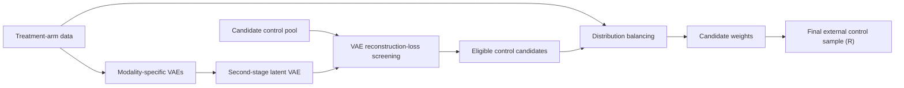

# DBEC

Research implementation for constructing an external control arm from a large
candidate pool using variational autoencoders (VAEs), reconstruction-based
screening, and distribution-balancing weights.

This repository accompanies an academic paper. It contains the core Python
implementation, a Python/R demonstration notebook, and the R code used to
generate the simulation data.

> **Research software:** The code is provided to support transparency and
> reproducibility. It has not been packaged as a production library.

## Method overview

The implemented workflow:

1. separates baseline covariates into binary, categorical, ordinal, and
   continuous components;
2. fits modality-specific VAEs to the treatment-arm data;
3. fits a second-stage VAE to the concatenated latent representations;
4. screens the candidate control pool using reconstruction losses;
5. estimates balancing weights for the retained candidates using kernel
   maximum mean discrepancy (KMMD), Euclidean energy balancing, or a
   mini-batch neural-network KMMD variant; and
6. optionally samples a final external control arm and evaluates covariate
   similarity in R.



## Repository contents

| File | Purpose |
| --- | --- |
| `Implementation_demo.ipynb` | End-to-end Google Colab demonstration, including R-based control sampling and evaluation |
| `run_pipeline.py` | Main Python entry point: `run_full_simulation_from_data` |
| `data_preprocessing.py` | Covariate splitting and categorical one-hot encoding |
| `models_ebd.py` | VAE model definitions and modality-specific loss functions |
| `vae_trainers.py` | VAE training, evaluation, and artifact export |
| `latent_utils.py` | Combination of modality-specific latent embeddings |
| `outlier_detection.py` | Reconstruction-loss intersection screening |
| `mmd.py` | KMMD, neural-network KMMD, and Euclidean balancing |
| `utils_distributions.py` | Distribution utilities used by the VAE models |
| `data generation.Rmd` | Simulation-data generation for the scenarios used in the study |

## Requirements

The demonstration notebook was created with Python 3.12 and is configured for
Google Colab. A CUDA-capable GPU is recommended for the full experiments, but
the Python pipeline can use a CPU.

Core Python dependencies:

- NumPy
- pandas
- SciPy
- Matplotlib
- PyTorch
- Transformers

Additional dependencies used by the notebook:

- Jupyter
- `pyreadr`
- `rpy2`
- R (the notebook installs/loads the required R packages)

To create a local Python environment:

```bash
python -m venv .venv
```

Activate it on macOS or Linux:

```bash
source .venv/bin/activate
```

Or on Windows PowerShell:

```powershell
.\.venv\Scripts\Activate.ps1
```

Then install the Python dependencies:

```bash
python -m pip install --upgrade pip
python -m pip install numpy pandas scipy matplotlib torch transformers jupyter pyreadr rpy2
```

For GPU-enabled PyTorch, use the installation command appropriate for your
CUDA version from the
[official PyTorch installation guide](https://pytorch.org/get-started/locally/).

## Data requirements

The main pipeline requires two row-oriented tables:

- **treatment data**: baseline covariates for the trial or treatment arm;
- **candidate pool**: baseline covariates for all potential external controls.

Both tables must have the same columns in the same order. The implementation
expects:

- binary variables encoded as `0`/`1`;
- categorical variables encoded as consecutive integers beginning at `0`;
- ordinal variables encoded as integer levels;
- continuous variables stored as numeric values; and
- no outcome or treatment-indicator column in either input table.

Column roles are supplied as zero-based indices in the preprocessing
configuration. The current implementation does not impute missing values, so
inputs should be cleaned before calling the pipeline.

Patient-level or otherwise restricted source data are not included in this
repository.

## Quick start: Python pipeline

The example below shows the main API. Replace the input paths and column
indices with values appropriate for your data.

```python
import numpy as np
import pandas as pd
import torch

from run_pipeline import run_full_simulation_from_data

seed = 42
np.random.seed(seed)
torch.manual_seed(seed)
if torch.cuda.is_available():
    torch.cuda.manual_seed_all(seed)

device = torch.device("cuda" if torch.cuda.is_available() else "cpu")

treatment = pd.read_csv("data/treatment.csv")
candidate_pool = pd.read_csv("data/candidate_pool.csv")

config = {
    "preprocess": {
        "binary_indices": [0, 1, 2, 3, 4],
        "categorical_indices_with_levels": {5: 4, 6: 6},
        "ordinal_indices": [7, 8],
        "continuous_indices": [9],
    },
    "vae": {
        "binary": {
            "batch_size": 128,
            "epochs": 1000,
            "hidden_dim": 50,
            "n_components": 2,
            "lr": 0.005,
            "scheduler": "cosine",
        },
        "ordinal": {
            "batch_size": 128,
            "epochs": 1000,
            "hidden_dim": 50,
            "n_components": 2,
            # One number of levels for each ordinal variable.
            "ordinal_K": [4, 4],
            "embedding_dim": 4,
            "lr": 0.005,
            "scheduler": "cosine",
        },
        "cont": {
            "batch_size": 128,
            "epochs": 1000,
            "hidden_dim": 50,
            "n_components": 1,
            "lr": 0.005,
            "scheduler": "cosine",
        },
        "latent": {
            "batch_size": 128,
            "epochs": 1000,
            "hidden_dim": 32,
            "n_components": 3,
            "lr": 0.005,
            "scheduler": "cosine",
        },
    },
    "detection": {
        # Optional simulation diagnostic: number of leading candidate-pool
        # rows generated from the treatment distribution.
        "n_same": None,
    },
    "kmmd": {
        "method": "euclidean",
        "use_latent": False,
        "epochs": 50_000,
        "lr": 0.01,
        "sigma": 1.0,
        "ssl_penalty": False,
        "lambda0": 5,
        "lambda1": 0.1,
        "adjust": False,
        "scheduler": "cosine",
    },
}

(
    weights,
    eligible_mask,
    treatment_processed,
    pool_processed,
    eligible_processed,
    treatment_original,
    pool_original,
    eligible_original,
) = run_full_simulation_from_data(
    data=treatment,
    big_data=candidate_pool,
    configs=config,
    output_root="output",
    return_result_type="original",
    device=device,
)
```

`weights` contains one balancing weight per retained candidate.
`eligible_mask` is a Boolean mask over the original candidate pool.

The available balancing methods are:

| `kmmd.method` | Implementation |
| --- | --- |
| `"rbf"` | Full-batch RBF-kernel MMD |
| `"euclidean"` or `"eucl"` | Full-batch Euclidean energy balancing |
| `"nn"` | Mini-batch RBF-kernel MMD with a neural weight model |

Set `kmmd.use_latent=True` to balance in the second-stage VAE latent space
instead of the processed covariate space. The full-batch methods construct
pairwise matrices and may require substantial memory for large candidate
pools; use `"nn"` when mini-batch optimization is preferable.

## Running the demonstration notebook

`Implementation_demo.ipynb` is the reference end-to-end example. It combines
the Python pipeline with R routines for local pivotal sampling, propensity
score matching, entropy balancing, and SuperLearner-based similarity
assessment.

1. Open the notebook in Google Colab and select a GPU runtime if available.
2. Upload or mount the repository and change the notebook's working-directory
   cell to the repository location.
3. Place `trt.rds` and `big.rds` at the paths used in the final notebook cell,
   or edit those paths.
4. Review the feature-index and ordinal-level configuration.
5. Run the cells in order.

The notebook installs or loads these R packages:
`SuperLearner`, `earth`, `glmnet`, `ranger`, `e1071`,
`BalancedSampling`, `MatchIt`, `ebal`, `WeightIt`, `osqp`, `kbal`,
`caret`, and `sampling`.

The full settings in the notebook use 1,000 epochs for each VAE and 50,000
balancing iterations. For a smoke test, reduce these values before launching a
complete experiment.

## Reproducing the simulated data

Open `data generation.Rmd` in RStudio or render it with:

```r
rmarkdown::render("data generation.Rmd")
```

The R Markdown file defines 10- and 20-covariate scenarios containing binary,
categorical, ordinal, and continuous variables. It uses a master seed of
`12345`, creates 20 replicate-specific seeds, and writes treatment and
candidate-pool data as `trt.rds` and `big.rds`.

Before rendering, inspect the scenario blocks and output-directory names. The
file contains multiple experimental settings, and each block writes its
replicates to a scenario-specific relative directory.

Required R packages for data generation are `tidyverse`, `fastDummies`,
`MASS`, `ggplot2`, `dplyr`, `tidyr`, `readr`, and `patchwork`.

## Outputs

By default, artifacts are written beneath the selected `output_root`:

```text
output/
├── vae/
│   ├── binary/
│   ├── ordinal/
│   ├── cont/
│   ├── latent_vae/
│   └── intersection/
└── kmmd/
```

Depending on the save flags, these directories contain trained model
checkpoints, latent means and log variances, reconstruction losses, diagnostic
plots, the candidate-eligibility mask, retained candidate covariates, balancing
parameters, and final weights.

To reuse saved artifacts, call the pipeline with `train_vae=False` and/or
`train_kmmd=False` while keeping the same `output_root` and configuration.

## Reproducibility notes

- Set NumPy and PyTorch seeds before each run.
- GPU and CPU results may differ slightly because of numerical precision and
  nondeterministic backend operations.
- Record the software versions, device, configuration dictionary, random seed,
  and commit identifier for each reported experiment.
- Do not commit confidential or patient-level data, model artifacts derived
  from restricted data, or other protected outputs.

## Citation

If you use this code, please cite the accompanying manuscript:

> Ke, Z., Cui, M., Moran, G., & Cabrera, J. (2026). *Distributional
> Balancing with Machine Learning for Clinical Trial Augmentation Using
> Real-World Data*. Manuscript in preparation, Department of Statistics,
> Rutgers University, New Brunswick.

```bibtex
@unpublished{ke2026distributional,
  title       = {Distributional Balancing with Machine Learning for Clinical
                 Trial Augmentation Using Real-World Data},
  author      = {Ke, Zern and Cui, Mingshi and Moran, Gemma and Cabrera, Javier},
  year        = {2026},
  institution = {Department of Statistics, Rutgers University, New Brunswick},
  note        = {Manuscript in preparation}
}
```

After the paper is submitted or published, update this entry with its journal
or preprint-server information and DOI. When referring specifically to the
software, also include the repository URL and the release tag or commit
identifier used in the analysis.

## License

This project is licensed under the [MIT License](LICENSE).
