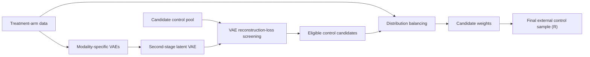

# DBEC

Research implementation for constructing an external control arm from a large
candidate pool using variational autoencoders (VAEs), reconstruction-based
screening, and distribution-balancing weights.

This repository accompanies an academic paper. It contains the core Python
implementation, a Python/R demonstration notebook, simulation-data generation
code, and the preprocessing workflow used for the MIMIC-IV analysis.

> **Research software:** The code is provided to support transparency and
> reproducibility. It has not been packaged as a production library.

## Method overview

The implemented workflow:

1. separates baseline covariates into binary, categorical, ordinal, and
   continuous components;
2. fits modality-specific VAEs to the treatment-arm data;
3. fits a second-stage VAE to the concatenated latent representations;
4. screens the candidate control pool using reconstruction losses;
5. estimates balancing weights for the retained candidates using kernel
   maximum mean discrepancy (KMMD), or Euclidean energy balancing;
6. optionally samples a final external control arm and evaluates covariate
   similarity in R.



## Repository contents

| File | Purpose |
| --- | --- |
| `Implementation_demo.ipynb` | End-to-end Google Colab demonstration, including R-based control sampling and evaluation |
| `run_pipeline.py` | Main Python entry point: `run_full_simulation_from_data` |
| `data_preprocessing.py` | Covariate splitting and categorical one-hot encoding |
| `models_ebd.py` | VAE model definitions and modality-specific loss functions |
| `vae_trainers.py` | VAE training, evaluation, and artifact export |
| `latent_utils.py` | Combination of modality-specific latent embeddings |
| `outlier_detection.py` | Reconstruction-loss intersection screening |
| `mmd.py` | KMMD, neural-network KMMD, and Euclidean balancing |
| `utils_distributions.py` | Distribution utilities used by the VAE models |
| `data/simulated data/data generation.Rmd` | Simulation-data generation for the scenarios used in the study |
| `data/mimic-iv/datapreprocess.Rmd` | Construction of the MIMIC-IV treatment and candidate-control cohorts |
| `data/mimic-iv/LICENSE.txt` | PhysioNet Credentialed Health Data License governing the MIMIC-IV data |
| `data/pacer/data preprocess.Rmd` | Preprocessing of PACER-based synthetic clinical-trial and real-world-data inputs |

## Requirements

The demonstration notebook was created with Python 3.12 and is configured for
Google Colab. A CUDA-capable GPU is recommended for the full experiments, but
the Python pipeline can use a CPU.

Core Python dependencies:

- NumPy
- pandas
- SciPy
- Matplotlib
- PyTorch
- Transformers

Additional dependencies used by the notebook:

- Jupyter
- `pyreadr`
- `rpy2`
- R (the notebook installs/loads the required R packages)

To create a local Python environment:

```bash
python -m venv .venv
```

Activate it on macOS or Linux:

```bash
source .venv/bin/activate
```

Or on Windows PowerShell:

```powershell
.\.venv\Scripts\Activate.ps1
```

Then install the Python dependencies:

```bash
python -m pip install --upgrade pip
python -m pip install numpy pandas scipy matplotlib torch transformers jupyter pyreadr rpy2
```

For GPU-enabled PyTorch, use the installation command appropriate for your
CUDA version from the
[official PyTorch installation guide](https://pytorch.org/get-started/locally/).

## Data organization

Only reproducible code and licensing information are included:

```text
data/
|-- simulated data/
|   `-- data generation.Rmd
|-- mimic-iv/
|   |-- datapreprocess.Rmd
|   `-- LICENSE.txt
`-- pacer/
    `-- data preprocess.Rmd
```

`data/simulated data/` contains the R Markdown source used to generate the
simulation inputs. Generated simulation replicates are written to
scenario-specific subdirectories selected inside the R Markdown file.

No MIMIC-IV source data, PACER patient-level data, derived patient-level data,
or prepared analysis datasets are included in this repository.

### MIMIC-IV access and redistribution

MIMIC-IV and MIMIC-IV-Ext-MDS-ED are credentialed PhysioNet resources. Users
must independently obtain access, complete the required training, and accept
the applicable data use agreement. `admissions.csv` comes from
[MIMIC-IV](https://physionet.org/content/mimiciv/), while `mds_ed.csv` comes
from
[MIMIC-IV-Ext-MDS-ED version 1.0.0](https://physionet.org/content/multimodal-emergency-benchmark/1.0.0/)
(DOI: [10.13026/p90d-vd84](https://doi.org/10.13026/p90d-vd84)).

> **Do not publish the MIMIC data files in a public GitHub repository.**
> `admissions.csv`, `mds_ed.csv`, `trt.rds`, and `big.rds` contain restricted
> or derived patient-level data and remain subject to the
> [PhysioNet Credentialed Health Data License](data/mimic-iv/LICENSE.txt).
> The license does not permit sharing access with other users. Keep these files
> outside version control; publish only the preprocessing code and instructions.

The repository's MIT License applies to the software only. It does not replace
or modify the terms governing MIMIC-IV or any derived data.

When reporting results, cite the exact MIMIC-IV version used and the
MIMIC-IV-Ext-MDS-ED version 1.0.0 dataset:

> Lopez Alcaraz, J. M., & Strodthoff, N. (2024).
> *MIMIC-IV-Ext-MDS-ED: Multimodal Decision Support in the Emergency
> Department—a Benchmark Dataset for Diagnoses and Deterioration Prediction in
> Emergency Medicine* (Version 1.0.0). PhysioNet.
> https://doi.org/10.13026/p90d-vd84

### MIMIC-IV preprocessing

Run `data/mimic-iv/datapreprocess.Rmd` from its own directory after placing the
authorized source files there. The workflow:

1. reads `mds_ed.csv` and `admissions.csv`;
2. retains one complete record per subject after joining ED-derived features
   with admission characteristics;
3. defines the treatment cohort as a random sample of 1,000 Medicaid records;
4. defines the candidate-control pool as the non-Medicaid records;
5. removes identifiers, insurance, and the `deterioration_icu_24h` outcome from
   the model inputs; and
6. writes the processed covariates to `trt.rds` and `big.rds`.

Set an R seed immediately before `slice_sample()` if the exact sampled
treatment cohort must be regenerated. The script produces a 1,000-record
treatment cohort; the size of the non-Medicaid candidate pool depends on the
authorized source-data version and preprocessing result.

The MIMIC-IV inputs use these zero-based feature indices:

| Modality | Indices | Variables |
| --- | --- | --- |
| Binary | `0, 2, 3, 4, 5, 7, 8, 9, 10, 11, 12` | Gender, four ethnicity indicators, and six diagnosis indicators |
| Continuous | `1, 6` | Age and median heart rate |
| Categorical | `13: 5`, `14: 4` | Language (5 levels) and marital status (4 levels) |
| Ordinal | None | No ordinal variables are used in this analysis |

The preprocessing R Markdown file requires `readr`, `dplyr`, `ggplot2`,
`tidyverse`, `patchwork`, and `forcats`.

### PACER-based synthetic data

The PACER example is based on the Placental Abruption and Cardiovascular Event
Risk cohort described by Ananth et al. The underlying PACER patient-level data
are not publicly available because of data-privacy restrictions and are not
included in this repository.

The PACER-based synthetic clinical-trial and real-world-data inputs used by
this workflow come from Cabrera et al. (2026), *Advancing Evidence Generation
in Biomedical Research Using Natural Hermite and Propensity Score Indices:
Applications to External Control Arms*. That study generated the synthetic
datasets using the
[DNAMR R package](https://github.com/xaviercabrera/DNAMR). DNAMR is distributed separately under the GPL-3.0 License.

Related publications and software:

- Ananth, C. V., Lee, R., Valeri, L., Ross, Z., Graham, H. L., Khan, S. P.,
  Cabrera, J., Rosen, T., & Kostis, W. J. (2024). *Placental Abruption and
  Cardiovascular Event Risk (PACER): Design, data linkage, and preliminary
  findings*. **Paediatric and Perinatal Epidemiology, 38**(3), 271-286.
  [https://doi.org/10.1111/ppe.13039](https://doi.org/10.1111/ppe.13039);
  [PubMed PMID: 38273776](https://pubmed.ncbi.nlm.nih.gov/38273776/)
- Cabrera, J., Alemayehu, B., Alemayehu, D., & Weigle, S. (2026).
  *Advancing Evidence Generation in Biomedical Research Using Natural Hermite
  and Propensity Score Indices: Applications to External Control Arms*.
  arXiv:2602.24127.
  [https://doi.org/10.48550/arXiv.2602.24127](https://doi.org/10.48550/arXiv.2602.24127)
- Cabrera, J. [DNAMR](https://github.com/xaviercabrera/DNAMR), R package
  repository.

Run `data/pacer/data preprocess.Rmd` from its own directory after obtaining the
synthetic inputs associated with Cabrera et al. (2026):

- `CTfinal.RDS`: synthetic clinical-trial cohort;
- `RWDfinal.RDS`: synthetic real-world candidate pool.

The preprocessing workflow:

1. renames `MONTH` to `YEAR`;
2. converts `REGION`, `RACE`, `HOSPBEDR`, and `HOSPOWN` to factors;
3. combines `PE_MILD` and `PE_SEVERE` into a binary `PE` variable;
4. numerically encodes the factor variables;
5. restricts the real-world candidate pool to `YEAR >= 26` and shifts the year
   scale by 25 in both cohorts; and
6. writes `trt.rds` and `big.rds` beneath
   `data for vml/filter year/`.

Create the output directory before rendering the file. The PACER preprocessing
script requires R and `dplyr`. The generated synthetic inputs and processed
outputs are intentionally not included in this repository.

### General input requirements

The main pipeline requires two row-oriented tables:

- **treatment data**: baseline covariates for the trial or treatment arm;
- **candidate pool**: baseline covariates for all potential external controls.

Both tables must have the same columns in the same order. The implementation
expects:

- binary variables encoded as `0`/`1`;
- categorical variables encoded as consecutive integers beginning at `0`;
- ordinal variables encoded as integer levels;
- continuous variables stored as numeric values; and
- no outcome or treatment-indicator column in either input table.

Column roles are supplied as zero-based indices in the preprocessing
configuration. The current implementation does not impute missing values, so
inputs should be cleaned before calling the pipeline.

For a public release, provide simulated data or instructions that allow
credentialed users to reconstruct restricted real-world inputs locally.

## Quick start: Python pipeline

The example below shows the main API for the MIMIC-IV analysis. It assumes that
an authorized, credentialed user has run `data/mimic-iv/datapreprocess.Rmd`
locally to create `trt.rds` and `big.rds`. These files are intentionally not
provided by this repository.

```python
import numpy as np
import torch
import pyreadr

from run_pipeline import run_full_simulation_from_data

seed = 42
np.random.seed(seed)
torch.manual_seed(seed)
if torch.cuda.is_available():
    torch.cuda.manual_seed_all(seed)

device = torch.device("cuda" if torch.cuda.is_available() else "cpu")

def read_rds(path):
    objects = pyreadr.read_r(path)
    return next(iter(objects.values()))

treatment = read_rds("data/mimic-iv/trt.rds")
candidate_pool = read_rds("data/mimic-iv/big.rds")

config = {
    "preprocess": {
        "binary_indices": [0, 2, 3, 4, 5, 7, 8, 9, 10, 11, 12],
        "categorical_indices_with_levels": {13: 5, 14: 4},
        "ordinal_indices": [],
        "continuous_indices": [1, 6],
    },
    "vae": {
        "binary": {
            "batch_size": 128,
            "epochs": 1000,
            "hidden_dim": 50,
            "n_components": 2,
            "lr": 0.005,
            "scheduler": "cosine",
        },
        "cont": {
            "batch_size": 128,
            "epochs": 1000,
            "hidden_dim": 50,
            "n_components": 1,
            "lr": 0.005,
            "scheduler": "cosine",
        },
        "latent": {
            "batch_size": 128,
            "epochs": 1000,
            "hidden_dim": 32,
            "n_components": 3,
            "lr": 0.005,
            "scheduler": "cosine",
        },
    },
    "detection": {
        # Optional simulation diagnostic: number of leading candidate-pool
        # rows generated from the treatment distribution.
        "n_same": None,
    },
    "kmmd": {
        "method": "euclidean",
        "use_latent": False,
        "epochs": 50_000,
        "lr": 0.01,
        "sigma": 1.0,
        "ssl_penalty": False,
        "lambda0": 5,
        "lambda1": 0.1,
        "adjust": False,
        "scheduler": "cosine",
    },
}

(
    weights,
    eligible_mask,
    treatment_processed,
    pool_processed,
    eligible_processed,
    treatment_original,
    pool_original,
    eligible_original,
) = run_full_simulation_from_data(
    data=treatment,
    big_data=candidate_pool,
    configs=config,
    output_root="output/mimic-iv",
    return_result_type="original",
    device=device,
)
```

`weights` contains one balancing weight per retained candidate.
`eligible_mask` is a Boolean mask over the original candidate pool.

The available balancing methods are:

| `kmmd.method` | Implementation |
| --- | --- |
| `"rbf"` | Full-batch RBF-kernel MMD |
| `"euclidean"` or `"eucl"` | Full-batch Euclidean energy balancing |
| `"nn"` | Mini-batch RBF-kernel MMD with a neural weight model |

Set `kmmd.use_latent=True` to balance in the second-stage VAE latent space
instead of the processed covariate space. The full-batch methods construct
pairwise matrices and may require substantial memory for large candidate
pools; use `"nn"` when mini-batch optimization is preferable.

## Running the demonstration notebook

`Implementation_demo.ipynb` is the reference end-to-end example. It combines
the Python pipeline with R routines for local pivotal sampling, propensity
score matching, entropy balancing, and SuperLearner-based similarity
assessment.

1. Open the notebook in Google Colab and select a GPU runtime if available.
2. Upload or mount the repository and change the notebook's working-directory
   cell to the repository location.
3. For the MIMIC-IV analysis, first generate the restricted inputs locally
   with `data/mimic-iv/datapreprocess.Rmd`, then change the notebook paths to
   `data/mimic-iv/trt.rds` and `data/mimic-iv/big.rds`.
4. Replace the notebook's simulation feature configuration with the MIMIC-IV
   indices shown in the Python quick start above.
5. Run the cells in order.

The notebook installs or loads these R packages:
`SuperLearner`, `earth`, `glmnet`, `ranger`, `e1071`,
`BalancedSampling`, `MatchIt`, `ebal`, `WeightIt`, `osqp`, `kbal`,
`caret`, and `sampling`.

The full settings in the notebook use 1,000 epochs for each VAE and 50,000
balancing iterations. For a smoke test, reduce these values before launching a
complete experiment.

## Reproducing the simulated data

Open `data/simulated data/data generation.Rmd` in RStudio or render it with:

```r
rmarkdown::render("data/simulated data/data generation.Rmd")
```

The R Markdown file defines 10- and 20-covariate scenarios containing binary,
categorical, ordinal, and continuous variables. It uses a master seed of
`12345`, creates 20 replicate-specific seeds, and writes treatment and
candidate-pool data as `trt.rds` and `big.rds`.

Before rendering, inspect the scenario blocks and output-directory names. The
file contains multiple experimental settings, and each block writes its
replicates to a scenario-specific relative directory.

Required R packages for data generation are `tidyverse`, `fastDummies`,
`MASS`, `ggplot2`, `dplyr`, `tidyr`, `readr`, and `patchwork`.

## Outputs

Artifacts are written beneath the selected `output_root`:

```text
<output_root>/
|-- vae/
|   |-- binary/
|   |-- ordinal/
|   |-- cont/
|   |-- latent_vae/
|   `-- intersection/
`-- kmmd/
```

Depending on the save flags, these directories contain trained model
checkpoints, latent means and log variances, reconstruction losses, diagnostic
plots, the candidate-eligibility mask, retained candidate covariates, balancing
parameters, and final weights.

To reuse saved artifacts, call the pipeline with `train_vae=False` and/or
`train_kmmd=False` while keeping the same `output_root` and configuration.

## Reproducibility notes

- Set NumPy and PyTorch seeds before each run.
- GPU and CPU results may differ slightly because of numerical precision and
  nondeterministic backend operations.
- Record the software versions, device, configuration dictionary, random seed,
  and commit identifier for each reported experiment.
- Do not commit confidential or patient-level data, model artifacts derived
  from restricted data, or other protected outputs.
- Record the DNAMR version or commit used to generate PACER-based synthetic
  inputs.

## Citation

If you use this code, please cite the accompanying manuscript:

> Ke, Z., Cui, M., Moran, G., & Cabrera, J. (2026). *Distributional
> Balancing with Machine Learning for Clinical Trial Augmentation Using
> Real-World Data*. Manuscript in preparation, Department of Statistics,
> Rutgers University, New Brunswick.

```bibtex
@unpublished{ke2026distributional,
  title       = {Distributional Balancing with Machine Learning for Clinical
                 Trial Augmentation Using Real-World Data},
  author      = {Ke, Zern and Cui, Mingshi and Moran, Gemma and Cabrera, Javier},
  year        = {2026},
  institution = {Department of Statistics, Rutgers University, New Brunswick},
  note        = {Manuscript in preparation}
}
```

After the paper is submitted or published, update this entry with its journal
or preprint-server information and DOI. When referring specifically to the
software, also include the repository URL and the release tag or commit
identifier used in the analysis.

## License

The source code is licensed under the [MIT License](LICENSE). MIMIC-IV source
and derived data are governed separately by the
[PhysioNet Credentialed Health Data License](data/mimic-iv/LICENSE.txt).
[DNAMR](https://github.com/xaviercabrera/DNAMR) is a separate dependency
distributed under the GPL-3.0 License.
